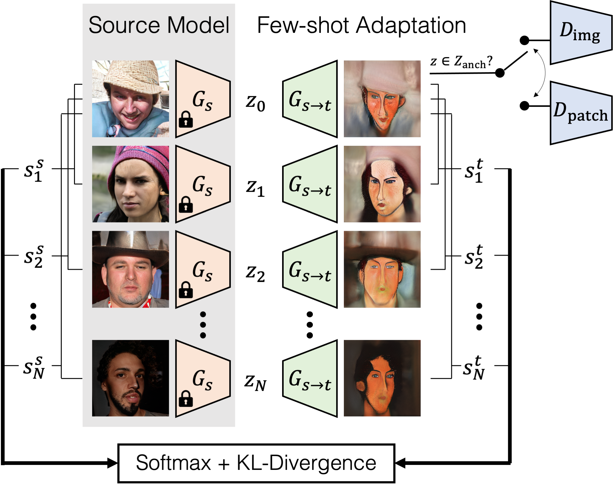

# Few-shot Image Generation via Cross-domain Correspondence

[Utkarsh Ojha](https://utkarshojha.github.io/), [Yijun Li](https://yijunmaverick.github.io/), [Jingwan Lu](https://research.adobe.com/person/jingwan-lu/), [Alexei A. Efros](https://people.eecs.berkeley.edu/~efros/), [Yong Jae Lee](https://web.cs.ucdavis.edu/~yjlee/), [Eli Shechtman](https://research.adobe.com/person/eli-shechtman/), [Richard Zhang](https://richzhang.github.io/)

Adobe Research, UC Davis, UC Berkeley


PyTorch implementation of adapting a source GAN (trained on a large dataset) to a target domain using very few images.

### [Project page](https://utkarshojha.github.io/few-shot-gan-adaptation/) | [Paper](https://arxiv.org/abs/2104.06820)

## Overview



Our method helps adapt the source GAN where one-to-one correspondence is preserved between the source G<sub>s</sub>(z) and target G<sub>t</sub>(z) images.

## Requirements

**Note:** The base model is taken from [StyleGAN2](https://github.com/rosinality/stylegan2-pytorch)'s implementation from [@rosinality](https://github.com/rosinality)

- Linux
- NVIDIA GPU + CUDA CuDNN 10.2
- PyTorch 1.7.0
- Python 3.6.9
- Install all the libraries through `pip install -r requirements.txt` 

## Testing

We provide the pre-trained models for different source and adapted (target) GAN models. 
| Source GAN: G<sub>s</sub> | Target GAN: G<sub>s&#8594;t</sub> |
| ------------------------- | --------------------------------- |
| [FFHQ](https://drive.google.com/file/d/1TQ_6x74RPQf03mSjtqUijM4MZEMyn7HI/view?usp=sharing) | [[Sketches](https://drive.google.com/file/d/1Qkdeyk_-1pqgvrIFy6AzsSYNgZMtwKX3/view?usp=sharing)] [[Caricatures](https://drive.google.com/file/d/1CX8uYEWqlZaY7or_iuLp3ZFBcsOOXMt8/view?usp=sharing)] [[Amedeo Modigliani](https://drive.google.com/file/d/1WvBtThEakKNqNFBCuHHoNNI1jojFAvan/view?usp=sharing)] [[Babies](https://drive.google.com/file/d/1d5JNwQBSyFaruAoLZBlXFVPc_I6WZjhm/view?usp=sharing)] [[Sunglasses](https://drive.google.com/file/d/1D6HOdcHG4j6kQmOCjwQakK7REgykPOYy/view?usp=sharing)] [[Rafael](https://drive.google.com/file/d/1K6xWnlfQ-qT_I_QTY8SiQ9fvRylMFeND/view?usp=sharing)] [[Otto Dix](https://drive.google.com/file/d/1I8gmuiDcARmwZNimlYEalPsKcRot-ijZ/view?usp=sharing)] |
| [LSUN Church](https://drive.google.com/file/d/18NlBBI8a61aGBHA1Tr06DQYlf-DRrBOH/view?usp=sharing) | [[Haunted houses]()] [[Van Gogh houses]() [[Landscapes]()] [[Caricatures]()] |
| [LSUN Cars](https://drive.google.com/file/d/1O-yWYNvuMmirN8Q0Z4meYoSDtBfJEjGc/view?usp=sharing) | [[Wrecked cars]()] [[Landscapes]()] [[Haunted houses]()] [[Caricatures]()] | 
| [LSUN Horses](https://drive.google.com/file/d/1ED4JPQsxnBUMFHiooCL7oK2x4FfIf-bt/view?usp=sharing) | [[Landscapes]()] [[Caricatures]()] [[Haunted houses]()] |
| [Hand gestures](https://drive.google.com/file/d/1LBXphEMT8C2JJ3AXf2CETeIFvoAz5n2T/view?usp=sharing) | [[Google Maps]()] [[Landscapes]()] |

For now, we have only included the pre-trained models using FFHQ as the source domain, i.e. all the models in the first row. We will add the remaining ones soon.

Download the pre-trained model(s), and store it into `./checkpoints` directory.

### Sample images from a model

To generate images from a pre-trained GAN, run the following command:

```bash
CUDA_VISIBLE_DEVICES=0 python generate.py --ckpt_target /path/to/model/
```

Here, `model_name` follows the notation of `source_target`, e.g. `ffhq_sketches`. Use the `--load_noise` option to use the noise vectors used for some figures in the paper (Figures 1-4). For example:

```bash
CUDA_VISIBLE_DEVICES=0 python generate.py --ckpt_target ./checkpoints/ffhq_sketches.pt --load_noise noise.pt
```

This will save the images in the `test_samples/` directory.

### Visualizing correspondence results

To visualize the same noise in the source and adapted models, i.e. G<sub>s</sub>(z) and G<sub>s&#8594;t</sub>(z), run the following command(s):

```bash
# generate two image grids of 5x5 for source and target
CUDA_VISIBLE_DEVICES=0 python generate.py --ckpt_source /path/to/source --ckpt_target /path/to/target --load_noise noise.pt

# visualize the interpolations of source and target
CUDA_VISIBLE_DEVICES=0 python generate.py --ckpt_source /path/to/source --ckpt_target /path/to/source --load_noise noise.pt --mode interpolate
python traversal_gif.py 10
```
- The second argument when running `traversal_gif.py` denotes the number of images you want to interpolate between.
- `--n_sample` determines the number of images to be sampled (default set to 25).
- `--n_steps` determines the number of steps taken when interpolating from G(z<sub>1</sub>) to G(z<sub>2</sub>) (default set to 40).
- `--mode` option determines the visualization type: generating either the images or interpolation .gif.
- The .gif file will be saved in `gifs/` directory.

### Hand gesture experiments

We collected images of random hand gestures being performed on a plain surface (~ 18k images), and used that as the data to train a source model (from scratch). We then adapted it to two different target domains; Landscape images and Google maps. The goal was to see if, during inference, interpolating the hand genstures can result in meaningful variations in the target images. Run the following commands to see the results:

```bash
CUDA_VISIBLE_DEVICES=0 python generate.py --ckpt_source /path/to/source --ckpt_target /path/to/maps(landscapes) --load_noise noise.pt --mode interpolate
```


### Evaluating FID 


The following table provides a link to the test set of domains used in Table 1:

- Babies -- [link](https://drive.google.com/file/d/1JmjKBq_wylJmpCQ2OWNMy211NFJhHHID/view?usp=sharing) 
- Sunglasses -- [link](https://drive.google.com/file/d/1Uu5y_y8Rjxbj2VEzvT3aBHyn4pltFgyX/view?usp=sharing) 
- Sketches -- [link](https://drive.google.com/file/d/1vgsB7ji-cLVzRhx43DvNSDgV5Up3jFJ2/view?usp=sharing) 


Download, and unzip the set of images into your desired directory, and compute the FID score (taken from [pytorch-fid](https://github.com/mseitzer/pytorch-fid)) between the real (R<sub>test</sub>) and fake (F) images, by running the following command

```bash
python -m pytorch_fid /path/to/real/images /path/to/fake/images
```

### Evaluating intra-cluster distance

Download the entire set of images from this [link](https://drive.google.com/file/d/1GtFHCnS_J8FbrQ0tkF4AFMYubyLsu_Xu/view?usp=sharing) (1.1 GB), which are used for the results in Table 2. The organization of this collection is as follows:
 
```
cluster_centers
└── amedeo			# target domain -- will be from [amedeo, sketches]
    └── ours			# baseline -- will be from [tgan, tgan_ada, freezeD, ewc, ours]
        └── c0			# center id -- there will be 10 clusters [c0, c1 ... c9]
            ├── center.png	# cluster center -- this is one of the 10 training images used. Each cluster will have its own center
            │── img0.png   	# generated images which matched with this cluster's center, according to LPIPS metric.
            │── img1.png
            │      .
	    │      .
                   
```
Unzip the file, and then run the following command to compute the results for a baseline on a dataset:

```bash
CUDA_VISIBLE_DEVICES=0 python feat_cluster.py --baseline <baseline> --dataset <target_domain> --mode intra_cluster_dist

E.g.
CUDA_VISIBLE_DEVICES=0 python feat_cluster.py --baseline tgan --dataset sketches --mode intra_cluster_dist
```


We also provide the utility to visualize the closest and farthest members of a cluster, as shown in Figure 14 (shown below), using the following command:

```bash
CUDA_VISIBLE_DEVICES=0 python feat_cluster.py --baseline tgan --dataset sketches --mode visualize_members
```

The command will save the generated image which is closest/farthest to/from a center as `closest.png`/`farthest.png` respectively.


## Training (adapting) your own GAN

### Choose the source domain
- Only the pre-trained model is needed, i.e. no need for access to the source data.
- Refer to the first column of the pre-trained models table above.
- If you wish to use some other source model, make sure that it follows the generator architecture defined in this [pytorch implementation](https://github.com/rosinality/stylegan2-pytorch) of StyleGAN2.

### Choose the target domain

- Below are the links to all the target domains, each consisting of 10 images, used in the paper.


| Sketches | Amedeo Modigliani | Babies | Sunglasses | Rafael | Otto Dix | Haunted houses | Van Gogh houses | Landscapes | Wrecked cars | Maps |  
| -- | -- | -- | -- | -- | -- | -- | -- | -- | -- | -- |
| [images](https://drive.google.com/file/d/1hC5mYgaamaLU9Jyi-WKtK1MoLhyc26kD/view?usp=sharing) | [images](https://drive.google.com/file/d/1D5X2hr7Z6EnY9HoxaGJb_vEvDVpSzjbz/view?usp=sharing) | [images](https://drive.google.com/file/d/1JygAunIzpMyRA9kPXobWSuwzVw7oOHU6/view?usp=sharing) | [images](https://drive.google.com/file/d/1sKPDlARZeWaHBJ3t3IIrSp295J_ct1cC/view?usp=sharing) | [images](https://drive.google.com/file/d/1EyRl-kR51ijOeGLR3ooc4t7iXlzW_VEc/view?usp=sharing) | [images](https://drive.google.com/file/d/1O7sizhlHPfeAYVT84gACgPNrD7tdk0Y_/view?usp=sharing) | [images](https://drive.google.com/file/d/1dbW-HTDT82t0ORkA0vlHcOX6dCyccqgu/view?usp=sharing) | [images](https://drive.google.com/file/d/1k5x76NvJRFd-XDSoZTDRtL_IdWD8_VKK/view?usp=sharing) | [images](https://drive.google.com/file/d/1zYw3iTc2NM6LStHpM8sscq24EDwNkEsy/view?usp=sharing) | [images](https://drive.google.com/file/d/1IBv1cwPaCFDUDvn9fo8KoCSaZ3s6bsFX/view?usp=sharing) | [images](https://drive.google.com/file/d/1qwVK2i7F7N4DJP3UdT-qkM7eTDmD7EJH/view?usp=sharing) |
| [processed](https://drive.google.com/file/d/1fe9VVAv2yTP2WMrXLBZXxZUAEfUXzQOK/view?usp=sharing) | [processed](https://drive.google.com/file/d/1y7wZ4BxqmCnBM9DqS1gBnkPawttWdcJ_/view?usp=sharing) | [processed](https://drive.google.com/file/d/1YjL9X5IbGVKinpqcL8o-H69g4skmOIfV/view?usp=sharing) | [processed](https://drive.google.com/file/d/1sKPDlARZeWaHBJ3t3IIrSp295J_ct1cC/view?usp=sharing) | [processed](https://drive.google.com/file/d/1NP44jz9zRPiWegFNY3KieaKYftxgmC-r/view?usp=sharing) | [processed](https://drive.google.com/file/d/1O7sizhlHPfeAYVT84gACgPNrD7tdk0Y_/view?usp=sharing) | [processed](https://drive.google.com/file/d/1K1s7Mi8D-k7U-W6BQ7f02TpA14OPnEDl/view?usp=sharing) | [processed](https://drive.google.com/file/d/1wJMwtMifGMDI8Io5tCeXhjiuYjOFhhD7/view?usp=sharing) | [processed](https://drive.google.com/file/d/1VBuh37h6Og5Qr_T3EvEYJYtH5pwTbE0B/view?usp=sharing) | [processed](https://drive.google.com/file/d/1KJXoXk_7qdJookTeqqpHiWrDTtR2EKLL/view?usp=sharing) | [processed](https://drive.google.com/file/d/1jDWaIuOfxk21ReD1UFY5zcXLB1XW-K9a/view?usp=sharing) |

**Note** We cannot share the images for the caricature domain due to license issues.

- If downloading the raw images, unzip them into `./raw_data` folder.
	- Run `python prepare_data.py --out processed_data/<dataset_name> --size 256 ./raw_data/<dataset_name>`
	- This will generate the processed version of the data in `./processed_data` directory. 
- Otherwise, if downloading directly the processed files, unzip them into `./processed_data` directory.
- Set the training parameters in `train.py`:	
	- `--n_train` should be set to the number of training samples (default is 10).
	- `--img_freq` and `ckpt_freq` control how frequently do the intermediate generated images and intermediate models are being saved respectively.
	- `--iter` determines the total number of iterations. In our experience, adapting a source GAN on FFHQ to artistic domains (e.g. Sketches/Amedeo's paintings) delivers decent results in 4k-5k iterations. For domains closer to natural faces (e.g. Babies/Sunglasses), we get the best results in about 1k iterations.

- Run the following command to adapt the source GAN (e.g. FFHQ) to the target domain (e.g. sketches):

```bash
CUDA_VISIBLE_DEVICES=0 python train.py --ckpt_source /path/to/source_model --data_path /path/to/target_data --exp <exp_name>

# sample run
CUDA_VISIBLE_DEVICES=0 python train.py --ckpt_source ./checkpoints/source_ffhq.pt --data_path ./processed_data/sketches --exp ffhq_to_sketches    
```
This will create directories with name `ffhq_to_sketches` in `./checkpoints/` (saving the intermediate models) and in `./samples` (saving the intermediate generated images). 

Runnig the above code with default configurations, i.e. batch size = 4, will use ~20 GB GPU memory.  


## Bibtex
If you find our code useful, please cite our paper:

```
@inproceedings{ojha2021few-shot-gan,
  title={Few-shot Image Generation via Cross-domain Correspondence},
  author={Ojha, Utkarsh and Li, Yijun and Lu, Cynthia and Efros, Alexei A. and Lee, Yong Jae and Shechtman, Eli and Zhang, Richard},
  booktitle={CVPR},
  year={2021}
}
```

## Acknowledgment

As mentioned before, the StyleGAN2 model is borrowed from this wonderful [pytorch implementation](https://github.com/rosinality/stylegan2-pytorch) by [@rosinality](https://github.com/rosinality). We are also thankful to [@mseitzer](https://github.com/mseitzer) and [@richzhang](https://github.com/richzhang) for their user friendly implementations of computing [FID score](https://github.com/mseitzer/pytorch-fid) and [LPIPS metric](https://github.com/richzhang/PerceptualSimilarity) respectively. 
