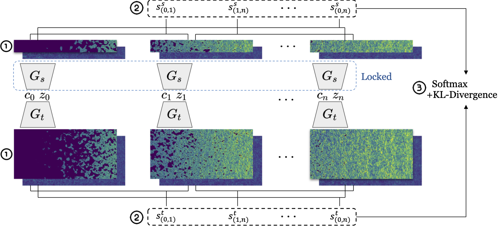

# Multi-fidelity Emulator for Cosmological Large Scale 21 cm Lightcone Images: a Few-shot Transfer Learning Approach with GAN



**Abtract**: Large-scale numerical simulations ($\gtrsim 500\rm{Mpc}$) of cosmic reionization are required to match the large survey volume for the upcoming Square Kilometre Array (SKA). We present a multi-fidelity emulation technique for generating large-scale lightcone images of cosmic reionization. We first train generative adversarial networks (GAN) on small-scale simulations and transfer that knowledge to large-scale simulations with hundreds of training images. Our method achieves high accuracy in generating lightcone images, as measured by various statistics with errors mostly below 10\%. This approach saves computational resources by 90\% compared to conventional training methods. Our technique enables efficient and accurate emulation of large-scale images of the Universe.

## Requirements

**Note:** The base model is taken from [StyleGAN2](https://github.com/rosinality/stylegan2-pytorch)'s implementation from [@rosinality](https://github.com/rosinality), our modifiled conditional version (and specified for 21 cm images) of it is in [this repo](https://github.com/dkn16/stylegan2-pytorch).

- Linux
- NVIDIA GPU + CUDA CuDNN 10.2
- PyTorch 1.7.0
- Python 3.7.3
- Install all the libraries through `pip install -r requirements.txt` 

## Training your own model

Here is an simple instruction on how to apply this repo to your own multi-fidelity dataset. 

### dataset

The first step before your training is to prepare your dataset. Here we use the `lmdb` package to create the dataset, as you can see in `prepare_21cmdata.py`. We highly recommend you to write your own dataset preparation code, as ours provided here is specifically designed and normalized for 21 cm data.

After you create your own preparing file, you can run the code via:
```bash
python prepare_21cmdata.py --your-own-arguments
```
Our example can be found in `run.sh`.

### model

Our model is constructed in model.py, in principle people do not need to care about most settings here, as they are adopted from the styleGAN2 architecture. One thing you may need to pay attention is the `ConstantInput` class. The output of `ConstantInput.forward` must have the same hidth-to-width ratio as your final desired output. For example, here in our code, is ratio is 1/2 because our desired lightcone image has a resolution of $(256,512)$.

### training

The training process has multiple arguments, while you can check the meaning of each one in `train.py`. Our setting is also shown in the `run.sh` (Some are commented).

### evaluation

We provided an example jupyter-notebook for evaluation, where you can see how do we generate our figures in our paper.

**For more information, you can check the readme of the orginal repo, or open a issue, or contact me at dkn16@foxmail.com**